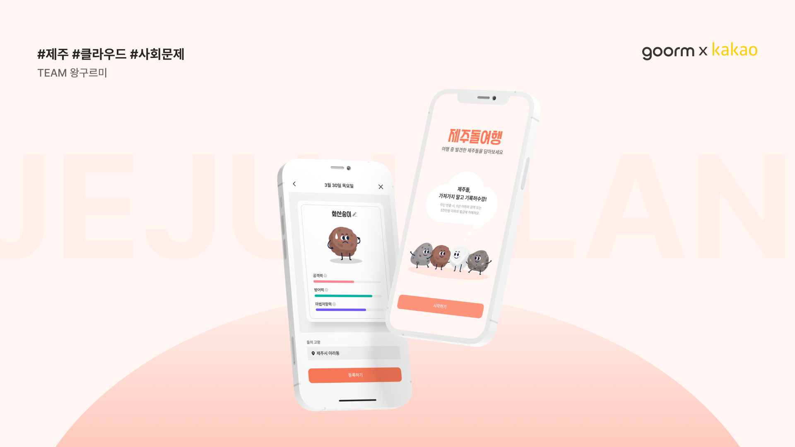
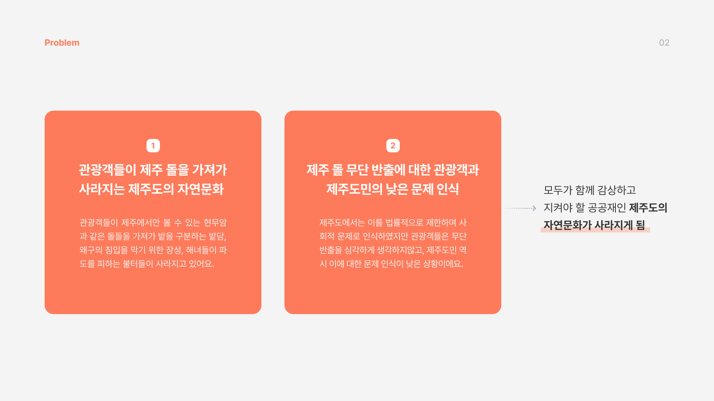
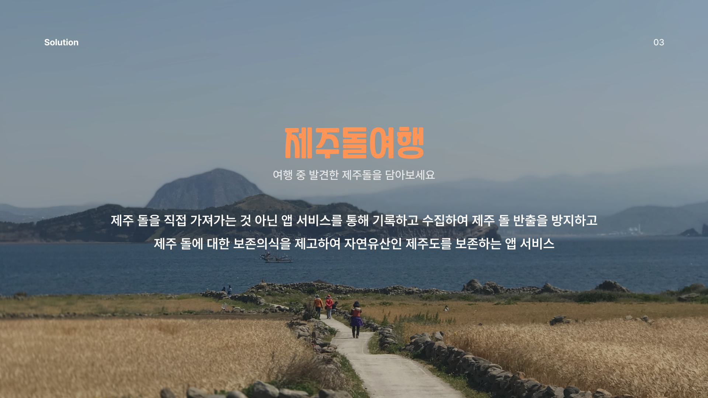
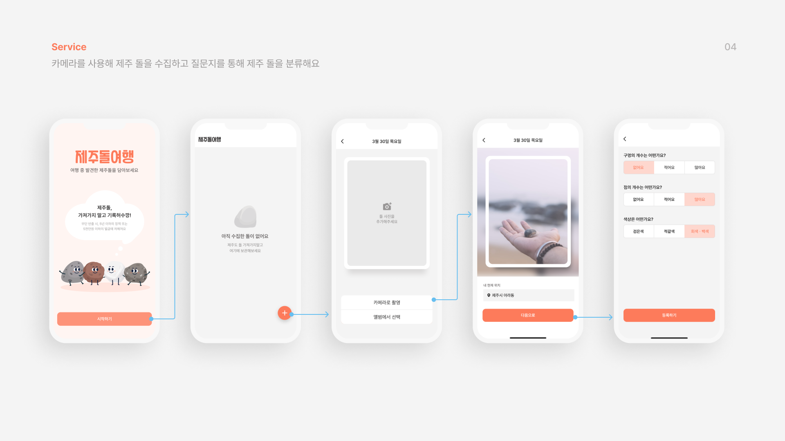
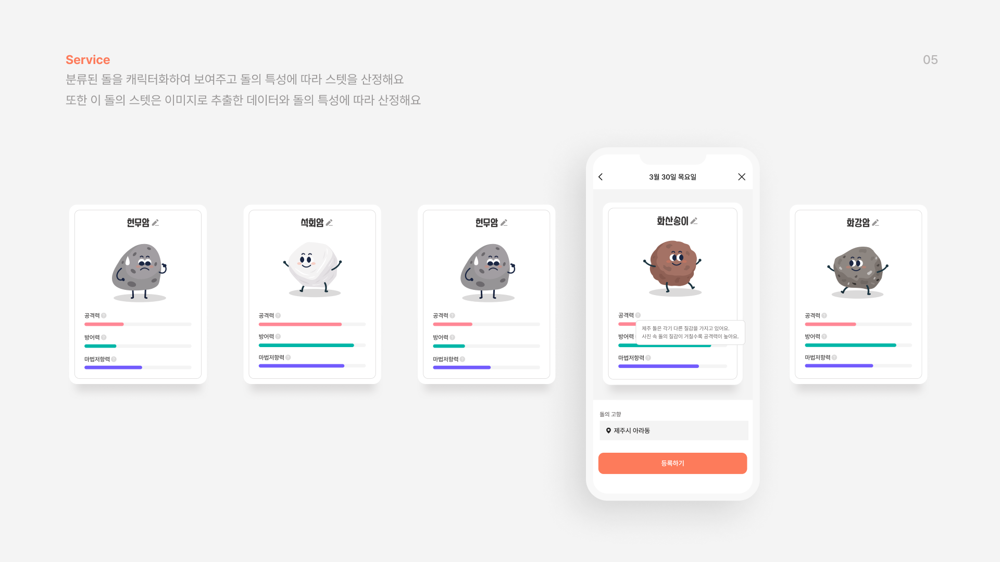
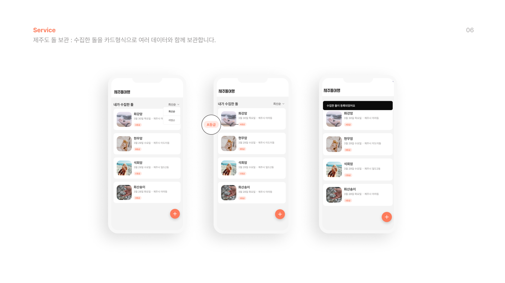
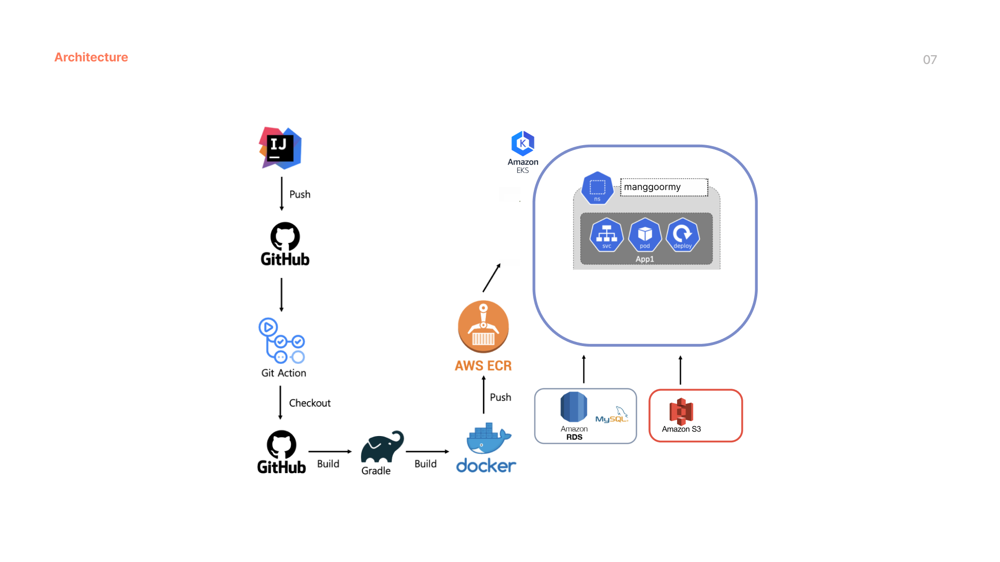

# 구르미 백엔드

### 프로젝트 설명

### 기술스택
- **Language** - Java 11
- **Framework** - Spring Framework (Spring Boot)
- **Data(RDBMS)** - JPA/Hibernate, MySQL
- **Build Tool** - Gradle
- **Infra** - AWS EKS, AWS ECR, AWS RDS, AWS S3, Docker
- **DB** - MySQL
- **CI/CD** - Github Actions , Docker
- **API Sheet** - Swagger

### 인프라 아키텍처

